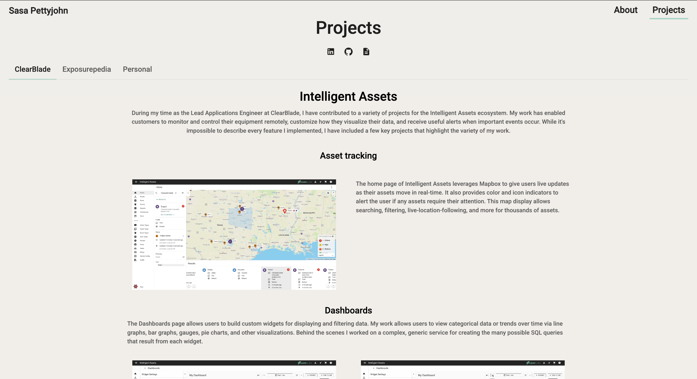

# Portfolio Website

- Checkout the website at:  https://sasapettyjohn.web.app
- If for some reason you are unable to view the site, please feel free to contact me at sasapettyjohn@gmail.com

#### By Sarah "Sasa" Pettyjohn, Current Version: February 2025

---

## Table of Contents

1. [Description](#description)
2. [Installation](#installation)
3. [Technologies Used](#technologies-used)
4. [Sample Images](#sample-images)

---

## Description

This portfolio website showcases my work in web development. It also provides access to my contact information and resume. The website itself was built by me and is ocassionally updated as needed.

## Installation

- clone repository to your desktop
- cd into the root directory

### `npm install`

### `npm run dev`(starts app on localhost:5173)

## Technologies Used

- React/Typescript
- Material UI and CSS
- React-Router
- Deployment via Firebase

## Sample Images

##### Homepage

##### Projects Page

