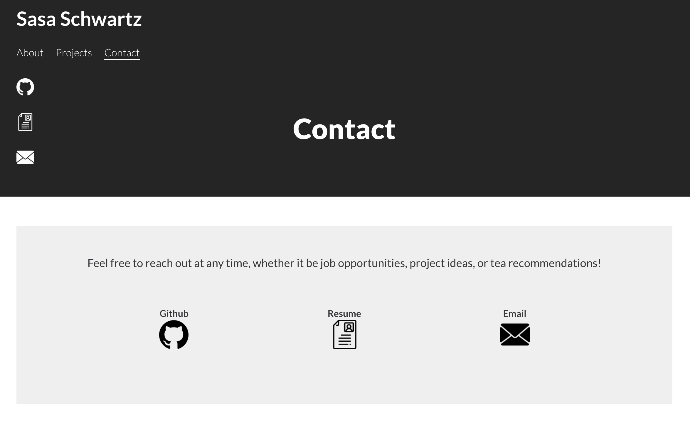

# Portfolio Website

- Checkout the website at:  https://sasaschwartz.com
- If for some reason you are unable to view the site, please feel free to contact me at sasapettyjohn@gmail.com

#### By Sarah "Sasa" Pettyjohn, Current Version: August 2023

---

## Table of Contents

1. [Description](#description)
2. [Installation](#installation)
3. [Technologies Used](#technologies-used)
4. [Sample Images](#sample-images)

---

## Description

This portfolio website showcases my work as a Front End Software Engineer. It also provides access to my contact information and resume. The website itself was built by me and is being continuously updated as I gain experience as a developer.

## Installation

- clone repository to your desktop
- cd into the root directory

  - npm install
  - npm start (starts app on localhost:3000)

## Technologies Used

- React Typescript
- Material UI
- React Router
- React Spring Animations
- Deployment via Github Pages
- Bulletproof React repository architecture

## Sample Images

##### Homepage

##### Contact Page

